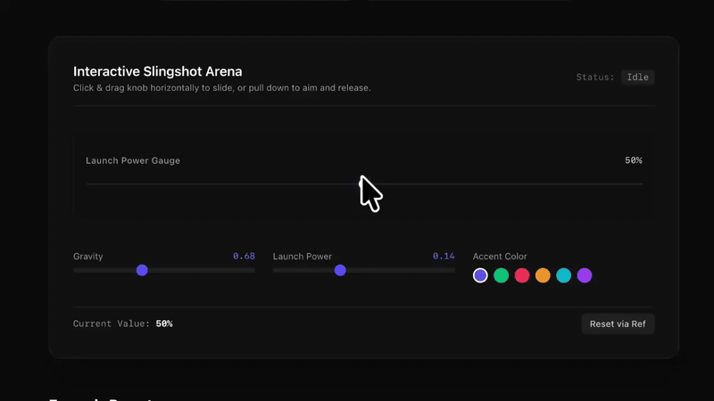

# 🎯 react-throwable-slider

A playful, physics-driven slingshot slider component for **React** and **Tailwind CSS**.

Slide normally along the horizontal track for precise adjustments, or pull down to slingshot the knob across the trajectory arc!

<div align="center">
  
</div>

---

## ✨ Features

- 🏹 **Slingshot Ballistics**: Real-time trajectory prediction with parabolic flight physics.
- ⚡ **0% Idle CPU**: Animation loop (`requestAnimationFrame`) runs on-demand only during aiming and flight.
- 🎨 **Tailwind CSS Ready**: Styled with idiomatic Tailwind CSS classes for effortless theme matching.
- 📏 **Quantization & Steps**: Supports arbitrary step sizes (`0.1`, `1`, `15`, etc.) and continuous ranges.
- ➕ **Signed Readouts**: Automatic `+` / `-` formatting for audio gain, EV, and temperature.
- 📱 **Touch & Mouse**: Full touch screen and desktop mouse/trackpad pointer support via Pointer Events.
- ♿ **Accessible**: Full keyboard navigation (`Arrow keys`, `Home`, `End`), ARIA slider roles and labels.
- 🚀 **Zero Setup with NPX**: Import directly into your project with a single command!

---

## 📦 Installation & Import

### Method 1: NPX Component Importer (Recommended)

Import the component directly into your project like a shadcn/ui component:

```bash
npx react-throwable-slider
```

Or specify your target folder directly:

```bash
npx react-throwable-slider src/components/ui
```

### Method 2: NPM Package

```bash
npm install react-throwable-slider
```

---

## 🚀 Quickstart

```tsx
import { ThrowableSlider } from '@/components/ui/ThrowableSlider';

export default function Example() {
  return (
    <div className="w-80 p-6 bg-neutral-900 rounded-xl">
      <ThrowableSlider
        label="Master Volume"
        unit="%"
        defaultValue={50}
        min={0}
        max={100}
        step={1}
        accentColor="#6366f1"
        onChange={(val) => console.log('Final value:', val)}
      />
    </div>
  );
}
```

---

## 🎛️ Props API

| Prop | Type | Default | Description |
| :--- | :--- | :--- | :--- |
| `label` | `string` | *required* | Label describing the slider parameter |
| `unit` | `string` | `""` | Unit suffix (e.g. `'%'`, `'°'`, `' dB'`, `' EV'`) |
| `min` | `number` | `0` | Minimum selectable value |
| `max` | `number` | `100` | Maximum selectable value |
| `step` | `number` | `1` | Step quantization interval (e.g. `1`, `0.1`, `15`) |
| `defaultValue`| `number` | `min` | Initial value in uncontrolled mode |
| `value` | `number` | `undefined` | Controlled value binding |
| `signed` | `boolean` | `false` | Prepends `+` for positive values |
| `gravity` | `number` | `0.68` | Gravitational acceleration during flight |
| `launchPower` | `number` | `0.14` | Impulse launch power multiplier |
| `accentColor` | `string` | `'#6366f1'`| Hex/RGB accent color for elastic bands & glow |
| `disabled` | `boolean` | `false` | Disables user interactions and dims opacity |
| `onInput` | `(val: number) => void` | `undefined` | Fires continuously as thumb moves |
| `onChange` | `(val: number) => void` | `undefined` | Fires when drag or flight completes |
| `className` | `string` | `""` | Additional Tailwind classes for root element |

---

## 🕹️ Programmatic Ref Handle

Use `ref` to imperatively reset or query the slider value:

```tsx
import { useRef } from 'react';
import { ThrowableSlider, type ThrowableSliderHandle } from '@/components/ui/ThrowableSlider';

export function ControlledDemo() {
  const sliderRef = useRef<ThrowableSliderHandle>(null);

  return (
    <div>
      <ThrowableSlider ref={sliderRef} label="Pitch" min={-12} max={12} signed />
      <button onClick={() => sliderRef.current?.reset()}>Reset to Default</button>
      <button onClick={() => alert(sliderRef.current?.getValue())}>Get Value</button>
    </div>
  );
}
```

---

## ⌨️ Keyboard Shortcuts

| Key | Action |
| :--- | :--- |
| `ArrowRight` / `ArrowUp` | Increment by `step` |
| `ArrowLeft` / `ArrowDown` | Decrement by `step` |
| `Home` | Jump to `min` |
| `End` | Jump to `max` |

---

## 👤 Author

**Pouya Hadidi**
- Website: [pouyahadidi.ir](https://pouyahadidi.ir)
- Contact: [contact@pouyahadidi.ir](mailto:contact@pouyahadidi.ir)

---

## 📄 License

[MIT](LICENSE) © 2025 [Pouya Hadidi](https://pouyahadidi.ir)
